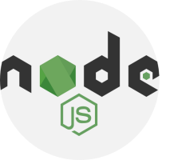

<!--
**kervijhonata/kervijhonata** is a ✨ _special_ ✨ repository because its `README.md` (this file) appears on your GitHub profile.

Here are some ideas to get you started:

- 🔭 I’m currently working on ...
- 🌱 I’m currently learning React & Python
- 👯 I’m looking to collaborate on Javascript Projects
- 🤔 I’m looking for help with ...
- 💬 Ask me about ...
- 📫 How to reach me: kervij@gmail.com || Telegram: https://t.me/kervijhonata
- 😄 Pronouns: He/Him
- ⚡ Fun fact: I LOVE cold coffee <3
-->

# Hey, ${user.you}, welcome!

| Name  | Age | Dev Role  | Pronours | Looking For | Accepts Collaborations |
|-------|-----|-----------|----------|-------------|------------------------|
| Kervi | 23  | Front-End | He / Him |  First Job  | TRUE:[freelancer, OSP] |

My name is Kervi, i'm 23y, actually living in Maranguape, Ceará, located on Brazil, my native country! I'm a front-end developer, graduated as I.T technician in 2017, but I'm actually learning to work with Node.JS 'cuz i wish being a Fullstack dev soonish!

## How Can i Serve you?

Technologies that i work with:
------------------------------

HTML5 
CSS3 
JAVASCRIPT 
PHP 
NODE.JS

What I'm currenty studing:
--------------------------

REACT 
NODE.JS 
PYTHON: 
JAVA: 

--------------------------

- 📫 Reach me on: kervij@gmail.com || Telegram: https://t.me/kervijhonata
- 🌎 Social: Instagram: https://www.instagram.com/kervijhonata
    
- 🔭 I'm Searching for first Job (front-end or fullstack node)
- 🌱 I’m currently learning React & Python
- 👯 I’m looking to Javascript Projects Collab
- 🤔 May you can help me with Node.JS Back-End

- 😄 Pronouns: He/Him
- ⚡ Fun fact: I rather my coffee cold!
